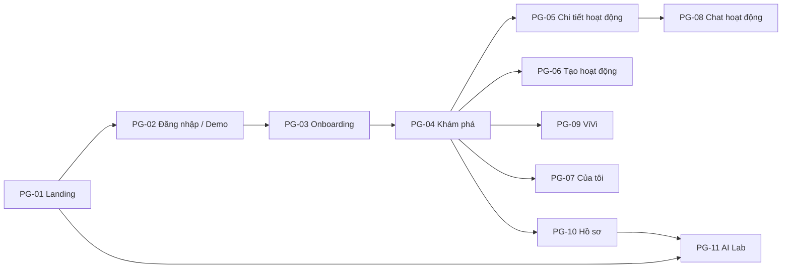

# Đặc tả UI/UX — VIVU Web (v3.0)

> Giữ nhận diện của v2.0 (gradient tím, thẻ bo góc, avatar tròn) và chuyển sang **web**. Mục tiêu: *trông và cảm giác như một sản phẩm thật*, và **làm cho AI nhìn thấy được**. Giá trị màu/kích thước là đề xuất, kiểm tra lại bằng công cụ trước khi chốt.

## 1. Nguyên tắc thiết kế

1. **Mobile-first**: thiết kế ở 360 px trước, mở rộng lên máy tính.
2. **Một việc chính mỗi màn**, hành động chính luôn nổi bật.
3. **AI luôn giải thích được**: mỗi nội dung AI có nhãn, lý do và đường dẫn tới "Vì sao?".
4. **Chuyển động có mục đích**: dẫn mắt, báo phản hồi, giữ ngữ cảnh. Không trang trí thừa.
5. **Tin cậy**: bình tĩnh, rõ ràng, không dọa người dùng; an toàn nói bằng giọng thân thiện.
6. **Tiếng Việt chuẩn**: kiểm tra dấu, độ dài chữ, ngắt dòng.

**Giọng văn:** thân thiện, xưng "bạn", câu ngắn. Ví dụ lỗi: "Chưa lưu được. Kiểm tra mạng rồi thử lại nhé."

## 2. Design tokens

### Màu
| Token | Giá trị | Dùng cho |
|---|---|---|
| `primary-600` | `#6A3DE8` | Nút chính, liên kết, trạng thái chọn |
| `primary-700` | `#5A2FD0` | Hover/pressed |
| `gradient-brand` | `135°, #6A3DE8 → #A66BFF` | Hero, ảnh bìa, huy hiệu AI |
| `accent-gold` / `accent-orange` | `#F5A623` / `#FF7A1A` | Huy hiệu uy tín (chữ tối trên nền vàng) |
| `ink` / `ink-2` | `#1B1530` / `#5B5670` | Chữ chính / phụ |
| `surface` / `bg` / `line` | `#F7F5FC` / `#FFFFFF` / `#E4E0F0` | Nền thẻ / nền trang / viền |
| `success` / `warning` / `danger` / `info` | `#1E9E6A` / `#B7791F` / `#D93A3A` / `#2D7FF9` | Trạng thái |
| `ai-tint` | `#EFE9FF` | Nền khối do AI tạo |

**Tương phản (tính sơ bộ, phải đo lại):** chữ trắng trên `#6A3DE8` ≈ 6,1:1 (đạt AA). Chữ trắng trên `#A66BFF` ≈ 3,4:1 (**chỉ đạt chữ lớn**) → chữ nhỏ không đặt ở nửa sáng của gradient; dùng nền đặc `primary-600` cho chữ thường.

### Chữ, khoảng cách, hình khối
| Hạng mục | Quy định |
|---|---|
| Font | **Be Vietnam Pro** (qua `next/font`, kiểm tra giấy phép), dự phòng `system-ui` |
| Thang chữ | Display 40/48 (desktop) · 32/40 (mobile) · H1 28/36 · H2 22/30 · H3 18/26 · Body 16/26 · Small 14/22 · Caption 12/18. Dòng cao ≥ 1,5 cho thân bài để dấu tiếng Việt không dính |
| Lưới | 4 pt; khoảng cách 4, 8, 12, 16, 24, 32, 48, 64 |
| Bố cục | Container tối đa 1200 px; 4 cột (mobile) / 8 (tablet) / 12 (desktop); lề 16/24/32 |
| Mốc responsive | `sm 640` · `md 768` · `lg 1024` · `xl 1280` |
| Bo góc | Thẻ 16 · nút 12 · input 12 · chip và avatar tròn |
| Độ cao (shadow) | 3 mức: thẻ, popover, modal |
| Vùng chạm | ≥ 44×44 px |
| Biểu tượng | Lucide, nét 1,75 px |
| Ảnh | Ảnh bìa hoạt động là **gradient + biểu tượng danh mục** sinh sẵn (không tải ảnh, không lo bản quyền) |

### Chuyển động (Framer Motion)
| Mục đích | Thời lượng / kiểu | Ví dụ |
|---|---|---|
| Phản hồi nhấn | 100–150 ms, ease-out | Nhấn nút scale 0,98 |
| Xuất hiện danh sách | 250 ms, stagger 40 ms | Thẻ hoạt động trượt lên nhẹ |
| Chuyển trang / chi tiết | 300–400 ms, spring (stiffness 260, damping 28) | Thẻ → trang chi tiết (shared layout) |
| Sắp xếp lại | `layout` animation | Xếp hạng đổi khi kéo thanh trọng số ở AI Lab |
| Streaming | Con trỏ nhấp nháy + chữ hiện dần | ViVi |
| **Giảm chuyển động** | Tôn trọng `prefers-reduced-motion`: chỉ mờ dần | Bắt buộc |

## 3. Thư viện component (shadcn/ui + tùy biến)

| Component | Biến thể và trạng thái bắt buộc |
|---|---|
| Button | primary (gradient) / secondary / ghost / danger; default, hover, pressed, focus, disabled, loading |
| Input, Textarea | default, focus, error + thông báo, disabled; bộ đếm ký tự cho bio/mô tả |
| Chip / Toggle | Sở thích, bộ lọc; chọn/không chọn |
| InterestGrid | 12 ô, bộ đếm "n/8", tối thiểu 3 |
| CommLevelPicker | 4 mức, emoji **kèm nhãn chữ** |
| ActivityCard | Ảnh bìa gradient, tiêu đề, địa điểm, thời gian, ProgressBar chỗ, Host + TrustBadge, **MatchBadge** |
| MatchBadge | Vòng % + nhãn "Hợp với bạn"; bấm mở **WhyPanel** |
| WhyPanel | 2–3 lý do (chip) + thanh phân rã 6 thành phần, có tooltip |
| TrustBadge | 5 band (mục 8); S/M/L |
| ProgressBar | "Còn N chỗ", "Sắp đủ", "Đã đầy" (chữ + thanh, không chỉ màu) |
| AIBadge | Nhãn "AI" nhỏ, nền `ai-tint`, biểu tượng lấp lánh |
| SourceCard | Số [n], tiêu đề đoạn kiến thức, trích đoạn, điểm tương đồng |
| ChatBubble | Của tôi / người khác / hệ thống / **ViVi** (nền `ai-tint`, nhãn AI) |
| GuardNotice | Cảnh báo/chặn: biểu tượng, **lý do**, cách sửa, nút Sửa |
| Stepper | Wizard tạo hoạt động (3 bước) |
| Tabs, Sheet, Dialog, Tooltip, Toast (sonner), Skeleton, Slider, Avatar | Theo shadcn; kiểm tra tiếp cận |
| Charts | Recharts: cột nhóm (baseline), đường (độ trễ) |

## 4. Điều hướng

**Điện thoại (< 768 px):** thanh tab dưới 4 mục — *Khám phá · ViVi · Của tôi · Hồ sơ*; nút **＋ Tạo** nổi (FAB) ở Khám phá. AI Lab vào từ menu Hồ sơ và từ landing.
**Máy tính (≥ 1024 px):** thanh trên cùng: logo · Khám phá · ViVi · Hoạt động của tôi · **AI Lab** · avatar; nút "Tạo hoạt động" nổi bật bên phải. Trang chi tiết dùng bố cục hai cột (nội dung + khung hành động dính).



## 5. Danh mục trang

| ID | Route | Mục đích | Thành phần chính | FR | Tuần | Ưu tiên |
|---|---|---|---|---|---|---|
| PG-01 | `/` | Giới thiệu, thuyết phục dùng thử | Hero có hình minh họa chuyển động, 3 bước hoạt động, **khối "AI trong VIVU" (3 thẻ)**, nút "Dùng thử với tài khoản demo", liên kết AI Lab | FR-SYS-01 | W1, W6 | M |
| PG-02 | `/login` | Đăng nhập | Email magic link; lưới 8 persona để vào một chạm; (Google) | FR-AUTH-01…05 | W1 | M |
| PG-03 | `/onboarding` | Thu thập hồ sơ | Stepper 3–4 bước: sở thích → phong cách & mục tiêu → bio → "Hồ sơ AI của bạn" | FR-ONB-01…04 | W2 | M |
| PG-04 | `/discover` | Khám phá | Hàng "Dành cho bạn" (MatchBadge), bộ lọc chip, danh sách; chuyển Danh sách/Bản đồ | FR-ACT-01, FR-MAT-01…03 | W2–W3 | M |
| PG-05 | `/activities/[id]` | Chi tiết | Ảnh bìa, thông tin, Host + band, ProgressBar chỗ, người tham gia, WhyPanel, **gợi ý bắt chuyện**, mẹo an toàn, nút Tham gia/Rút | FR-ACT-02, 04, FR-MAT-02, FR-VIV-05 | W2–W4 | M |
| PG-06 | `/activities/new` | Tạo hoạt động | Wizard 3 bước, chọn địa điểm từ danh sách, **GuardNotice theo thời gian thực** (sau khi ngừng gõ 600 ms), xem trước thẻ | FR-ACT-03, FR-GRD-01…04 | W2, W5 | M |
| PG-07 | `/my-activities` | Của tôi | Tab: Sắp tới · Đã tạo · Đã qua | FR-ACT-05 | W2 | M |
| PG-08 | `/activities/[id]/chat` | Chat nhóm | Danh sách tin, ô nhập, gợi ý ViVi | FR-CHT-01…03 | W5 | S |
| PG-09 | `/vivi` | Trợ lý | Khung chat, chip câu hỏi mẫu, thẻ hoạt động trong chat, SourceCard, "ViVi đã dùng nguồn nào?" | FR-VIV-01…08 | W4 | M |
| PG-10 | `/profile` | Hồ sơ + uy tín | Thông tin, sửa hồ sơ, TrustBadge, "Điểm được tính thế nào?" | FR-PRO-01, FR-TRU-01…03 | W2, W5 | M |
| PG-11 | `/ai-lab` | **Phòng thí nghiệm AI** | 4 tab: Match · ViVi · Safety · Đánh giá (mục 6) | FR-LAB-01…05 | W5–W6 | M |
| PG-12 | `/admin/reports` | Xem báo cáo | Bảng báo cáo | FR-GRD-05 | W6 | C |

## 6. Trang AI Lab (PG-11) — nơi "AI nhìn thấy được"

Mục đích: cho người xem **thấy và thử** cách từng AI vận hành. Bố cục: tiêu đề + 4 tab; mỗi tab có "Cách hoạt động" (1 đoạn ngắn + sơ đồ), khu tương tác, khu số liệu.

```
┌─ AI Lab ─────────────────────────────────────────────────────────┐
│ [Match] [ViVi] [Safety] [Đánh giá]                                │
├──────────────────────────────────────────────────────────────────┤
│ MATCH   Người dùng: [Linh ▾]    Hồ sơ AI: coffee · photo · "yên tĩnh"│
│  Trọng số:  Ngữ nghĩa ━━━●━━ .35   Sở thích ━━●━━━ .25            │
│             Giao tiếp ━●━━━━ .10   Thời gian ━●━━━ .10 ...        │
│  ┌ #1 Cà phê sách chiều thứ Sáu ········ 87% ┐  ▓▓▓▓▓░ ngữ nghĩa  │
│  │ #2 Săn ảnh hoàng hôn Mỹ Khê ··········· 81% │  ▓▓▓▓░░ sở thích   │
│  └ (thứ tự đổi mượt khi kéo thanh trọng số)  ┘  ▓▓░░░░ giao tiếp   │
└──────────────────────────────────────────────────────────────────┘
```
| Tab | Khu tương tác | Khu số liệu |
|---|---|---|
| **Match** | Chọn persona; kéo 6 thanh trọng số → xếp hạng đổi ngay (tính lại phía trình duyệt); bấm hoạt động xem phân rã | NDCG@5 của cấu hình hiện tại so với mặc định |
| **ViVi** | Nhập câu hỏi → 4 khối: ① câu hỏi chuẩn hóa ② các đoạn truy hồi + điểm (đoạn dưới ngưỡng làm mờ) ③ lời nhắc đã dựng ④ câu trả lời có [n] | Độ trễ từng bước (embed, tìm, sinh) |
| **Safety** | Nhập văn bản hoặc bấm 1 trong 6 ví dụ → luật nào kích hoạt (làm nổi bật đoạn khớp), nhãn, độ tin cậy, quyết định | Ma trận nhầm lẫn của EV-3 |
| **Đánh giá** | — | Bảng EV-1…EV-4, biểu đồ so sánh baseline, hộp **"Hạn chế"** luôn hiển thị, ngày chạy và phiên bản |

## 7. Trạng thái hệ thống (áp dụng cho mọi danh sách/màn chính)

| Trạng thái | Quy tắc | Lời nhắn mẫu |
|---|---|---|
| Đang tải | Skeleton đúng hình khối; không spinner toàn trang | — |
| Rỗng | Minh họa nhẹ + giải thích + **hành động tiếp theo** | Discover rỗng: "Chưa có hoạt động hợp bộ lọc. Thử nới bộ lọc hoặc tạo hoạt động đầu tiên." |
| Lỗi | Giữ nội dung đã có, thanh thông báo + "Thử lại" | "Chưa tải được. Kiểm tra mạng và thử lại nhé." |
| Mất mạng | Biểu ngữ "Không có kết nối"; vô hiệu hành động ghi, giải thích lý do | — |
| **AI đang xử lý** | Mô tả việc đang làm | "ViVi đang tìm trong 60 đoạn kiến thức…" |
| **AI dự phòng** | Nhãn rõ khi dùng phương án không AI | "Gợi ý theo sở thích (AI đang bận)" |
| **AI từ chối/không biết** | Thân thiện, gợi ý cách hỏi khác | "ViVi chưa có thông tin về điều này. Bạn thử hỏi về quán ăn, điểm tham quan hoặc di chuyển ở Đà Nẵng nhé." |
| **Guard chặn** | Lý do + cách sửa, không đổ lỗi | "Mô tả có số tài khoản. Hãy bỏ thông tin chuyển tiền rồi lưu lại." |
| Hết giới hạn | Nói rõ khi nào dùng lại | "Bạn đã hỏi ViVi nhiều. Thử lại sau ít phút nhé." |

## 8. Huy hiệu uy tín (TrustBadge) và nhãn AI

| Band | Hiển thị |
|---|---|
| Thành viên mới | Viền tím nhạt, biểu tượng mầm; không số |
| Đang xây dựng | Xám-tím trung tính |
| Ổn định | Cam `accent-orange` |
| Đáng tin | Vàng `accent-gold` |
| Rất đáng tin | Vàng + khiên |

**Không dùng đỏ** cho band thấp. Công khai chỉ band; số điểm và thành phần chỉ chủ tài khoản thấy. **AIBadge** xuất hiện trên: MatchBadge, câu trả lời ViVi, gợi ý bắt chuyện, mô tả do AI soạn, hồ sơ AI.

## 9. Tiếp cận và hiệu năng

| Hạng mục | Quy định |
|---|---|
| Bàn phím | Mọi thao tác dùng được bằng phím; thứ tự focus hợp lý; vòng focus rõ ràng (≥ 3:1) |
| Trình đọc màn hình | Nhãn cho nút biểu tượng; vùng `aria-live` cho tin nhắn ViVi và thông báo Guard; thanh tiến độ có giá trị chữ |
| Màu | Không chỉ dùng màu để truyền nghĩa; emoji luôn kèm chữ |
| Chữ | Phóng 200% không vỡ bố cục |
| Chuyển động | Tôn trọng `prefers-reduced-motion` |
| Hiệu năng | Font tối đa 2 độ đậm; ảnh sinh bằng CSS/SVG; tải chậm (lazy) phần biểu đồ AI Lab; mục tiêu ở Kiến trúc mục 7 |

## 10. Quy trình thiết kế (làm một mình)

1. **Tuần 1:** hoàn thiện tokens, 8 component nền, và khung 4 trang then chốt (PG-04, PG-05, PG-09, PG-11) bằng **mã trực tiếp** (có thể phác nhanh trên giấy/Figma, không cần bộ Figma đầy đủ).
2. Mỗi tuần dành ~3 giờ cho **rà soát giao diện**: so khung với mục 1–9, chụp ảnh màn hình ở 360/768/1280 px.
3. Tuần 6: kiểm thử khả năng sử dụng với 3–5 người (bạn bè) trên 3 tác vụ: *đăng nhập demo → tìm và tham gia một hoạt động → hỏi ViVi một câu*; ghi lại thời gian và chỗ vướng.
